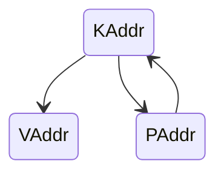

# 地址空间类型设计

## 介绍

目前当前系统中采用，三种地址空间设计，`PAddr`, `VAddr`, `KAddr`，三种类型分别应对以下几种情况:

- `PAddr`: 物理内存地址
- `VAddr`: 虚拟内存地址
- `KAddr`: 内核映射虚拟地址

对于 `PAddr` 和 `VAddr` 应该都不陌生，但是为什么需要 `KAddr`? 对于 `rseL4` 来说，我们没用使用 `rust` 的 `alloc` 库来进行内存的分配，那么我们就需要手动的管理内存，而有没有什么方法在我们能保证内存指针是正确的时候直接取到类新呢？一个方案就是在地址上动手，原来我们没有 `KAddr` 的时候，我们就是将 `VAddr` 直接进行处理，将指向的内存直接取出，但是对于 `VAddr` 来说，我们需要在内核中保证以下条件：

- 内存地址是有效的
- 虚拟地址指向的是当前的地址空间
- 是不是内核地址空间

但是对于 `KAddr` 来说，我们就没有这么多的顾虑，Rust 是强类型语言，且设计哲学是显式优于隐式，因此每一次转换我们都会可见。`KAddr` 指向的内存是从在内核区域将物理内存地址加上偏移后映射的，所以可以继承物理内存的有效性，内核地址空间在不同的程序之间是共享的，因此不会产生差异。

因此引入 `KAddr` 从编程以及设计上来说，都不失为一个好的选择。

三种地址的转换说明:

可以看到，`PAddr` 和 `VAddr` 之间没有了直接的内存转换，（如果需要转换的话，可以自己定义函数操作，但是安全性无法保证），`KAddr` 是一种特殊的存在，它和 `PAddr` 是对应的映射关系，可以互相转换。`KAddr` 可以转换为 `VAddr`，但是这个过程不可逆。

## 注意事项

灵感来源于 `seL4` 的 `pptr_t`，但是 `seL4` 会将设备映射到内核的一个特殊地址上，这样就不满足一对一映射的关系，目前在 `rseL4` 中没有这么做，如果这么做，那么 `KAddr` 和 `PAddr` 之间的转换就需要重新考虑。